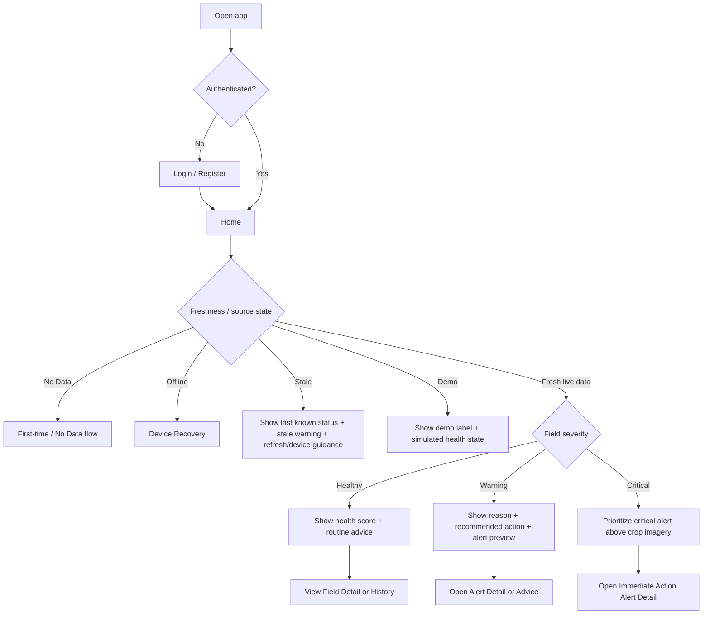
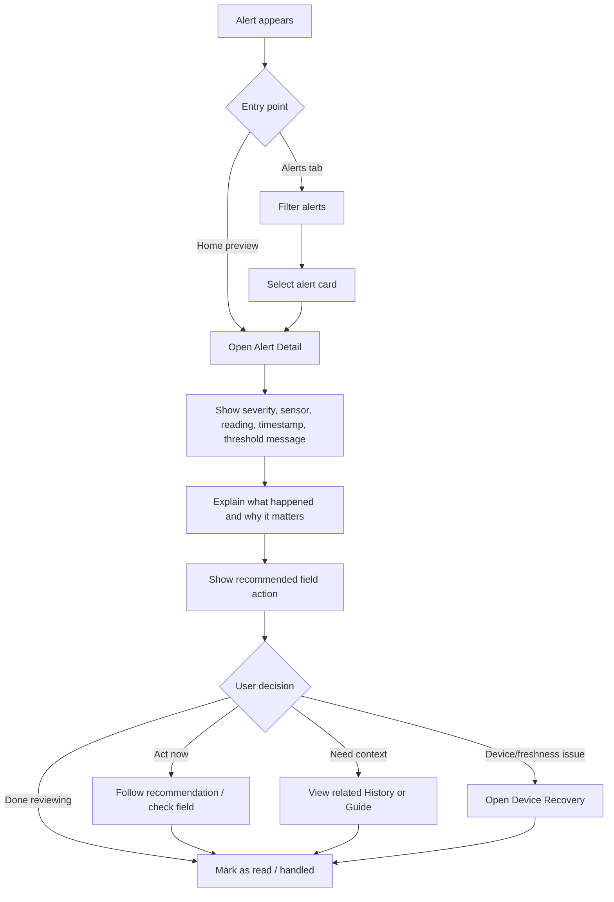
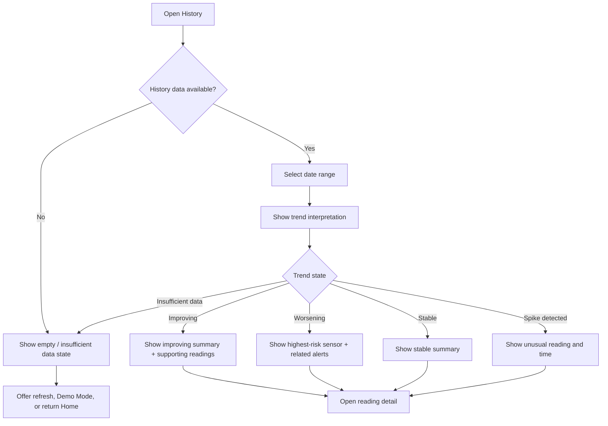
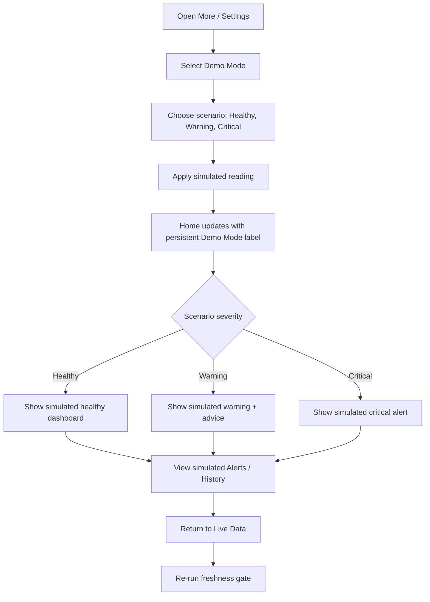
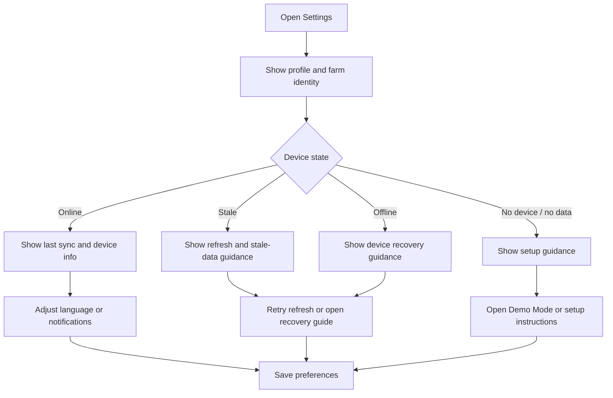
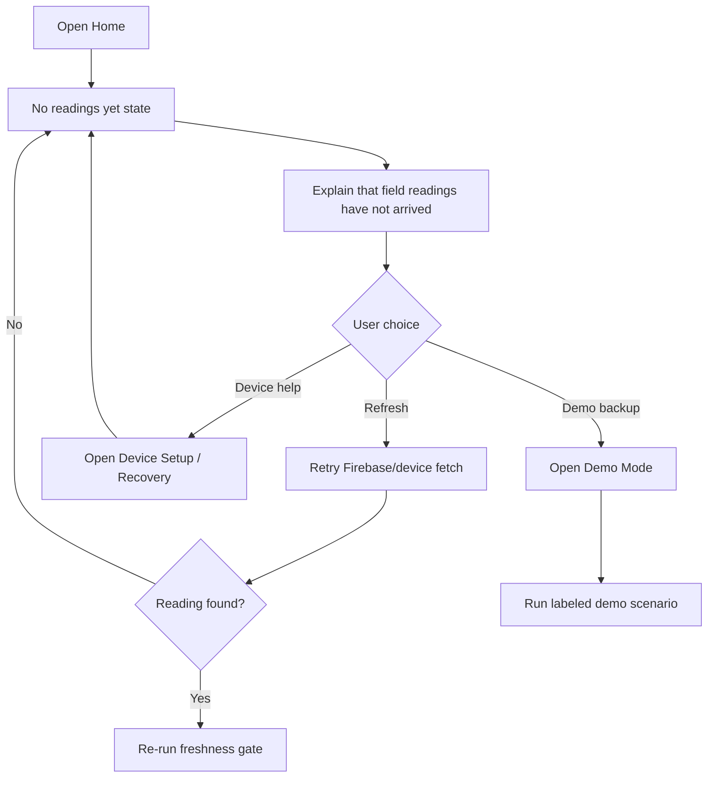

# UX Design Specification AgriShield

**Author:** LA
**Date:** 2026-05-22

---

<!-- UX design content will be appended sequentially through collaborative workflow steps -->

## Executive Summary

### Project Vision

AgriShield PH should feel like a practical rice field condition checker for small farmers, not a student demo interface or technical sensor dashboard. The UX should help a farmer answer one question quickly: "Is my field okay right now, or do I need to check it today?"

The main experience should reduce uncertainty before showing technical detail. The Dashboard should lead with the current Field Status, main concern, and Last Updated information before showing detailed sensor values. Sensor readings still matter, but the app should translate them into plain English meaning first, such as "Water is low," "Temperature is safe," or "Check field today."

The MVP is a conceptual student prototype, but the farmer-facing experience should remain practical and trustworthy. Trust depends on clarity when data is imperfect: old readings, missing readings, connection problems, and advisory threshold limits must be visible in the normal app experience, not hidden only in project explanation screens. Presentation and evaluation needs should stay secondary to the main farmer workflow.

### Target Users

The primary user is a small rice farmer who may rely on manual field checking and needs a simple mobile tool for awareness. This user needs large touch targets, readable text, strong status cues, and direct English labels that work even for someone with limited technical knowledge.

Secondary users include student presenters and evaluators. They need the app to clearly communicate the project concept, but project context should stay separated from the farmer-facing monitoring experience.

### Key Design Challenges

- Make the app feel like a farmer tool, not a technical dashboard or school presentation.
- Help users understand Field Status before they interpret raw sensor values.
- Communicate Warning and Critical conditions clearly without overstating what the prototype can guarantee.
- Make Alerts behave like action prompts that explain what changed, why it matters, and what to check next.
- Treat stale, missing, or unavailable readings as trust-sensitive states, not minor empty states.
- Handle missing data, old readings, and connection problems calmly through states like `No data yet`, `No Recent Reading`, `Last updated`, and `Connection unavailable`.
- Support evaluation and defense needs without contaminating the main farmer workflow.

### Design Opportunities

- Turn the Dashboard into a one-glance condition screen: current condition, main concern, and last reading time.
- Use plain English labels, strong icons, and clear status colors together so color is never the only meaning carrier.
- Make Alert Detail screens build trust by showing what happened, how serious it is, what reading caused it, and what practical step may help.
- Use History and Charts as secondary context to show whether a condition is new, worsening, or improving.
- Make Guide / Threshold Info a confidence-building section that explains statuses, thresholds, calibration limits, stale data, and monitoring-only scope honestly.
- Design empty, stale, and connection states as first-class UX moments because they protect user trust.

## Core User Experience

### Defining Experience

The core user experience of AgriShield PH is the one-glance Dashboard check. The farmer opens the app to answer a practical question: "Do I need to inspect my field now, or can I continue normally?"

The Dashboard must immediately show the current field condition, the main concern, the Last Updated time, and the next suggested field check without requiring a tap. Sensor readings still matter, but they are supporting evidence. The app should explain what the readings mean before asking the user to interpret raw numbers.

The UX may use farmer-facing labels such as `Okay`, `Needs Attention`, and `Critical`, while preserving the PRD status model of Normal, Warning, and Critical behind the scenes.

### Platform Strategy

AgriShield PH is a mobile-only, touch-based experience designed Android-first. The UX should assume small mobile screens, finger input, quick checks, and possible field conditions such as bright light, weak signal, or one-handed use.

The interface should use large touch targets, readable text, strong contrast, clear spacing, and simple navigation. It does not need full offline functionality for the MVP, but it must clearly handle no connection, no recent data, stale readings, and missing sensor values.

### Effortless Interactions

The following interactions should require almost no thought:

- Checking the current Field Status from the Dashboard.
- Seeing the main concern without opening another screen.
- Finding the Last Updated time.
- Seeing the suggested next check, such as `Check irrigation` or `Check water level`.
- Opening a relevant Alert from the Dashboard in one tap.
- Moving between Dashboard, Alerts, History, and More through bottom navigation.
- Recognizing when readings are unavailable, old, or not connected.

The Dashboard one-glance payload should include:

- Overall field status: `Okay`, `Needs Attention`, `Critical`, `No Recent Data`, or `No Connection`.
- Main concern: one short phrase, such as `Soil moisture low`.
- Last updated: clear freshness text, such as `Updated 12 min ago`.
- Suggested next check: one plain action, such as `Check irrigation`.
- Sensor summary: secondary detail, never the first thing users must interpret.

### Critical Success Moments

First-time success happens when the user opens the Dashboard and understands within a few seconds:

- Is my field okay?
- What is the main concern?
- When was this data last updated?
- What should I check next?

The make-or-break flow is Warning/Critical interpretation. If the app shows an abnormal status but does not clearly explain the concern and suggested field check, the experience fails.

Another critical moment is stale or missing data. If the app cannot show fresh readings, it must communicate that calmly and honestly so the user does not mistake old information for current field status.

The Dashboard should follow a priority rule: show the most urgent condition first, while keeping freshness visible. Critical conditions outrank attention states, attention states outrank normal states, and stale or missing data must never be hidden behind older normal-looking values.

### Experience Principles

- **Meaning before numbers:** Show plain English interpretation before raw sensor detail.
- **One-glance decision:** The Dashboard answers whether attention is needed now.
- **Actionable alerts:** Alerts should explain what changed, why it matters, and what to check next.
- **Honest freshness:** Last Updated, No Recent Data, stale readings, and connection states are always visible.
- **Mobile field simplicity:** Touch targets, labels, spacing, and contrast should support quick Android phone use in field conditions.
- **Farmer day first:** Design around quick checks between real farm work, not prolonged app use.
- **Farmer workflow first:** Presentation and evaluation needs must not interrupt the main farmer checking flow.

## Desired Emotional Response

### Primary Emotional Goals

AgriShield PH should make farmers feel calm, informed, and capable. The app should reduce uncertainty by clearly showing whether the field appears okay, needs attention, or requires urgent checking.

When the field is okay, the farmer should feel reassured and confident enough to continue normally. When the field needs attention, the farmer should feel guided rather than alarmed. When the field is critical, the farmer should feel clear urgency without panic.

When readings are stale, missing, or unavailable, the farmer should feel informed and cautious. The app should never create false confidence from old or incomplete data.

### Emotional Journey Mapping

- **First open:** The farmer should feel that the app is simple and understandable.
- **Normal / Okay state:** The farmer should feel reassured, calm, and in control.
- **Needs Attention state:** The farmer should feel guided toward a specific field check.
- **Critical state:** The farmer should feel urgency, but not fear or confusion.
- **Missing or stale data:** The farmer should feel clearly informed that the app cannot judge the current field condition.
- **Returning use:** The farmer should feel the app is familiar, practical, and worth checking again.

### Micro-Emotions

The UX should encourage:

- Confidence over confusion.
- Trust over skepticism.
- Calm attention over panic.
- Practical guidance over technical overwhelm.
- Caution over false certainty.
- Reassurance over blame.

The UX should avoid making the user feel responsible for problems caused by sensors, connection issues, old data, or prototype limitations.

### Design Implications

- Calm and practical tone should guide the default interface.
- Urgency should appear only when the status requires it.
- Color, icon, and text should work together so users do not depend on color alone.
- Missing or stale readings should be communicated plainly, not hidden or softened.
- Alert language should be direct and helpful, such as `Check water level`, not technical or frightening.
- Critical states should be visibly urgent but still give a clear next step.

### Emotional Design Principles

- **Calm by default:** Normal states should reduce worry.
- **Urgent only when needed:** Warning and Critical states should stand out without creating panic.
- **No false confidence:** Old, missing, or unavailable data must never look current.
- **Guidance over alarm:** Every abnormal state should point to what the farmer can check next.
- **No blame:** The app should never make the user feel at fault for sensor or connection issues.
- **Trust through honesty:** The app earns trust by showing freshness, limits, and uncertainty clearly.

## UX Pattern Analysis & Inspiration

### Inspiring Products Analysis

#### Smart Home App

Smart home apps are useful references because they handle device status, live state, and alerts in a simple consumer-facing way. They usually make it clear whether a device is online, offline, delayed, or needing attention.

For AgriShield PH, the transferable lesson is that field sensor data should feel like a monitored device state, not a spreadsheet. Users should immediately know whether the ESP32/device reading is available, current, stale, or unavailable. Alerts should be tied to a clear device or condition state and should not require technical interpretation.

Useful patterns:

- Clear online/offline status.
- Device cards with current state.
- Alerts tied to specific device conditions.
- Simple recovery messaging when a device is unavailable.

#### Weather App

Weather apps are strong references for one-glance environmental status. They show current condition first, then supporting details, hourly changes, warnings, and forecasts. Users do not need to interpret raw meteorological data before understanding whether conditions are safe, risky, or changing.

For AgriShield PH, the transferable lesson is to lead with interpreted field condition before sensor details. The Dashboard should work like a field weather summary: current condition, main concern, last updated time, and next suggested check. Warnings should be visible, plain, and tied to what the user should watch or do next.

Useful patterns:

- Current condition as the top-level message.
- Supporting detail cards below the main status.
- Warning banners that stand out without taking over the whole app.
- Time-based freshness and trend information.

#### Google Fit / Health App

Health apps are useful references because they turn repeated measurements into readable progress and trend views. They do not force users to analyze every data point; they summarize condition, direction, and history in a calm way.

For AgriShield PH, the transferable lesson is that History and Charts should help users understand whether a condition is new, worsening, improving, or stable. Charts should be simple and supportive, not the main decision surface.

Useful patterns:

- Dashboard cards with readable summaries.
- Gentle trend visualization.
- History grouped by time.
- Calm tone even when data changes.

### Transferable UX Patterns

- **One-glance condition summary:** Adopt from weather apps. The Dashboard should lead with field condition, main concern, and last updated time.
- **Device status clarity:** Adopt from smart home apps. The app should clearly show Online, No Connection, No Recent Data, or stale readings.
- **Actionable alert cards:** Adapt from smart home and weather alerts. Alerts should say what changed, why it matters, and what to check next.
- **Simple supporting cards:** Adopt from health dashboards. Sensor readings should appear as supporting cards after the interpreted status.
- **Trend context, not analytics:** Adapt from health apps. History and Charts should show whether conditions are improving, worsening, or stable.
- **Calm warning language:** Adopt from weather and health apps. Warning states should be clear without creating panic.

### Anti-Patterns to Avoid

- Leading with raw sensor numbers before meaning.
- Using color alone to communicate status.
- Showing stale readings as if they are current.
- Creating dense charts that feel like technical analytics.
- Writing alert titles like `Threshold exceeded` instead of farmer-facing messages like `Water level may be low`.
- Hiding connection or freshness problems in small text.
- Making all screens look like demo/presentation screens instead of a practical farmer tool.

### Design Inspiration Strategy

**What to Adopt**

- Weather-style current condition hierarchy: status first, details second.
- Smart-home-style device freshness and connection states.
- Health-app-style readable cards and calm trend summaries.

**What to Adapt**

- Weather alerts should become field-check alerts.
- Smart home device cards should become field/device reading cards.
- Health trend charts should become simple field condition trend views.

**What to Avoid**

- Technical dashboards that require users to interpret raw values.
- Alarm-heavy UI that creates fear instead of guided action.
- Overly polished demo visuals that weaken the farmer-tool feel.

## Design System Foundation

### 1.1 Design System Choice

AgriShield PH should use **AgriShield Field Material**: a themeable Flutter Material Design foundation customized with a small, farmer-focused design layer.

The app should rely on Flutter Material components for speed, consistency, accessibility, and Android familiarity, while defining AgriShield-specific rules for status, data confidence, dashboard hierarchy, alerts, and offline/no-data states.

This approach avoids the cost of a fully custom design system while preventing the app from feeling like a generic Material template or technical dashboard.

### Rationale for Selection

Flutter Material Design is the best fit because AgriShield PH is a mobile-only Flutter MVP with limited development time. Material components provide proven mobile patterns for navigation, buttons, forms, cards, dialogs, tabs, and accessible touch targets.

The AgriShield layer is needed because the product experience depends on farmer-readable meaning, not generic UI components. The design system must make field condition, data freshness, and next physical check visible and consistent across screens.

### Implementation Approach

The implementation should use Flutter Material components as the base for:

- App shell and navigation.
- Bottom navigation.
- Buttons and form fields.
- Cards and status panels.
- Alert list items and Alert Detail layouts.
- Dialogs, snackbars, and empty states.
- Chart containers and history lists.

Avoid over-customizing Material. Customize color, typography, spacing, shape, icon usage, and the main dashboard/status components. Do not create a bespoke component library unless repeated product needs force it.

Primary navigation should remain:

- Dashboard
- Alerts
- History
- More

Avoid adding primary tabs such as `Sensors`, `Analytics`, or `Recommendations` for the MVP because they pull the app toward a technical dashboard.

### Customization Strategy

AgriShield Field Material should define semantic tokens instead of hard-coded colors.

**Field status tokens**

- `status.okay`
- `status.needsAttention`
- `status.critical`

**Data confidence tokens**

- `confidence.recent`
- `confidence.delayed`
- `confidence.stale`
- `confidence.noConnection`

**Surface and text tokens**

- `surface.appBackground`
- `surface.card`
- `surface.statusCard`
- `text.primary`
- `text.secondary`
- `text.helper`
- `border.subtle`
- `state.disabled`

Status should use stronger color, icon, and label treatment. Data confidence should use quieter labels, timestamp styling, and gray/amber indicators. These two concepts must not compete visually.

### Component Rules

The MVP design system should standardize:

- **Field status card:** primary Dashboard card; shows status, main concern, data confidence, last updated, and next check.
- **Main concern card:** summarizes the leading issue when present.
- **Recommendation/action card:** gives one practical next physical check.
- **Sensor reading card:** secondary evidence, never the primary decision surface.
- **Alert card/list row:** severity, plain-language issue, affected reading, time, and recommended check.
- **History item:** timestamp, status, and compact reading summary.
- **Empty/offline/error state:** clear explanation and next step.
- **Warning banner:** used only when the state needs attention without taking over the full screen.

### Typography and Touch Rules

Use a small readable type scale:

- Dashboard status headline: large and high contrast.
- Section heading: clear but compact.
- Body text: readable and plain.
- Timestamp/helper text: smaller but still legible.
- Button text: direct action language.

Touch rules:

- Minimum tap target: `48x48 dp`.
- Primary action height: around `52-56 dp`.
- Avoid compact icon-only controls unless navigation is obvious.
- Dashboard primary status should be visible in the first viewport on common Android screen sizes.

### Icon and State Rules

Use familiar icons consistently:

- `Okay`: check / circle check.
- `Needs Attention`: warning / alert triangle.
- `Critical`: error / danger.
- `No Recent Data`: clock / history warning.
- `No Connection`: cloud off / wifi off.
- `History`: clock / list.
- `Field check`: checklist / field inspection cue.

Color must never carry meaning alone. Every important status must pair color with text and icon.

### Offline and No-Data Rules

Offline and stale states are first-class UX states, not edge cases. The design system must include visual patterns for:

- No recent data.
- No connection.
- Last updated unavailable.
- Sensor reading missing.
- Confidence warning.

Gray should communicate uncertainty, not safety. Copy should say what is happening, such as `No recent reading`, `Data is old`, or `Cannot update field data`.

## 2. Core User Experience

### 2.1 Defining Experience

The defining experience of AgriShield PH is the one-glance field check. After login, a farmer opens the Dashboard and can immediately tell the field's current apparent condition, the trustworthiness of the data, the main concern if any, and the next physical check to perform.

This experience should feel like a shortcut to awareness and prioritization, not a replacement for farmer judgment or physical field checking. The app helps the farmer decide whether to continue normally, inspect a specific condition, or respond to an urgent alert.

If the app gets this interaction right, the rest of the product has a clear foundation: Alerts explain abnormal states, History supports trend understanding, and Guide explains why the status exists.

### 2.2 User Mental Model

Farmers already understand field monitoring through observation: checking water level, soil wetness, weather conditions, and visible field changes. AgriShield PH should build on this mental model instead of asking users to think like sensor technicians.

The app should behave like a simple field status companion:

- What is happening now?
- Is this normal or concerning?
- Can I trust this reading?
- What should I physically check next?

Users are likely to get confused if the app leads with raw sensor values, technical thresholds, or unclear warning labels. They are more likely to trust the app when it gives a plain status, a clear concern, honest freshness information, and a practical next check.

### 2.3 Success Criteria

The defining experience succeeds when the first Dashboard viewport answers the farmer's core questions without scrolling or tapping:

- Is my field okay?
- What is the main concern, or is no concern detected?
- When was the latest reading received?
- Is the data current, stale, missing, or unavailable?
- What should I check next?

The Dashboard must make uncertainty visible. It must never present `Okay` when sensor data is stale, unavailable, disconnected, or incomplete.

A successful Dashboard check includes:

- Overall field status.
- Main concern or explicit `No immediate concern detected`.
- Last updated timestamp in farmer-readable relative time.
- Suggested next physical check.
- Data confidence state.
- Supporting sensor values as secondary evidence.

### 2.4 Novel UX Patterns

AgriShield PH does not need a novel interaction pattern. It should combine familiar patterns from weather apps, smart home apps, and health dashboards:

- Weather app pattern: current condition first, supporting details second.
- Smart home pattern: device status and connection clarity.
- Health app pattern: calm trend summaries and history.

The unique twist is applying these familiar patterns to a rice field condition checker. The product should feel immediately understandable because users already know how to read status cards, alerts, and simple history views.

### 2.5 Experience Mechanics

**1. Initiation**

The user opens the app and lands on the Dashboard after authentication. The Dashboard immediately presents the one-glance field check.

**2. Interaction**

The user does not need to tap, scroll, or interpret raw values to understand the main state. The first viewport shows:

- Field status: `Okay`, `Needs Attention`, or `Critical`.
- Data confidence: `Updated recently`, `No Recent Data`, or `No Connection`.
- Main concern, such as `Soil moisture low`, or `No immediate concern detected`.
- Last Updated time, such as `Updated 12 min ago`.
- Suggested next physical check, such as `Check water level`.
- Supporting sensor cards below the interpreted status.

If there is an active `Needs Attention` or `Critical` concern, the Dashboard provides a direct shortcut to the relevant Alert Detail.

**3. Feedback**

The system gives feedback through status label, color, icon, plain English message, and freshness text. Color supports meaning but does not carry meaning alone.

State contract:

| State | Meaning | Required UI |
|---|---|---|
| `Okay` | Recent data, no active concern | `No immediate concern detected` plus routine next check |
| `Needs Attention` | Non-critical threshold or trend needs checking | Concern summary plus Alert Detail shortcut |
| `Critical` | Urgent threshold or high-risk condition | Urgent concern plus prominent Alert Detail shortcut |
| `No Recent Data` | Last valid data is stale | `Data is old` plus check device/field guidance |
| `No Connection` | App cannot reach service/device | `Cannot update right now` plus retry/check connection guidance |

**4. Completion**

The user completes the interaction when they know whether to continue normally, check a specific field condition, or open the Alert Detail for more context.

**5. Recovery / Edge States**

If data is old, missing, unavailable, or disconnected, the app should not pretend the field is safe. It should show the uncertainty clearly and guide the user to check the device, connection, or field manually.

Implementation-facing rules:

- `Critical` outranks all other field states.
- `Needs Attention` outranks `Okay`.
- `No Connection` and `No Recent Data` block reassuring `Okay` presentation.
- If data freshness is unknown, status must be uncertainty-based, not safety-based.
- Every status maps to one primary action or next check.
- Active `Needs Attention` or `Critical` states expose a direct Alert Detail shortcut in the first viewport.
- Supporting sensor cards are secondary evidence, not the primary decision surface.

## Visual Design Foundation

### Color System

AgriShield Field Material uses a practical, Android-first Material visual system for farmers checking field status quickly outdoors. The UI is calm by default, honest about uncertainty, and urgent only when field risk requires action.

The color system should separate brand structure, field condition, and data confidence so the interface does not blur “healthy,” “trusted,” and “urgent” meanings.

**Base tokens**

```text
background.primary: #F7F8F2
surface.card: #FFFFFF
surface.subtle: #EEF2E8

text.primary: #18231B
text.secondary: #4D5A50
text.muted: #6F7A72
text.inverse: #FFFFFF
border.subtle: #D9E0D5

brand.field: #2F6B3F
brand.field.dark: #1F4D2E
```

**Field status tokens**

These tokens describe field condition severity and drive user-facing labels: `Okay`, `Needs Attention`, and `Critical`.

```text
status.good: #2E7D32
status.watch: #B26A00
status.alert: #B3261E
```

- `status.good` maps to `Okay`.
- `status.watch` maps to `Needs Attention`.
- `status.alert` maps to `Critical`.

**Data confidence tokens**

These tokens describe trust in the reading. They should never change the field severity label and must not visually compete with `Critical`.

```text
confidence.high: #4F7D5A
confidence.medium: #9A6A16
confidence.low: #7A7F78
```

Recommended confidence labels:

- `High confidence`
- `Medium confidence`
- `Low confidence`
- `Insufficient data`

**Color usage rules**

- Brand green is for navigation, structure, and small accents.
- Status green is only for the `Okay` field condition.
- Confidence green is muted and paired with a label.
- Amber means inspect soon or watch carefully; it should stay calm and readable.
- Red is reserved for confirmed or high-risk field action, not low confidence alone.
- Gray and muted confidence colors communicate uncertainty, not safety.
- Color must never be the only indicator. Every important state uses label, icon, and plain English copy.

### Typography System

Typography should prioritize outdoor readability, quick scanning, and plain English. Use Roboto or the system Material default.

```text
font.family: Roboto or system Material default

display.status: 28sp / 34, weight 700
title.card: 18sp / 24, weight 600
body.primary: 16sp / 22, weight 400
body.secondary: 14sp / 20, weight 400
label: 12sp / 16, weight 600
timestamp: 13sp / 18, weight 400
```

Typography rules:

- Dashboard status text must be large enough to scan outdoors.
- Main concern and next-check text should be direct and action-oriented.
- Metadata should not drop below `12sp`.
- Main action labels should not drop below `14sp`.
- Avoid decorative display type and tiny agricultural metadata.
- Avoid dense paragraphs on primary screens.

### Spacing & Layout Foundation

Use an `8dp` spacing system and compact mobile-first rhythm.

```text
space.1: 4dp
space.2: 8dp
space.3: 12dp
space.4: 16dp
space.5: 24dp
space.6: 32dp

screen.padding: 16dp
card.padding: 16dp
card.radius: 8dp
statusContainer.radius.max: 12dp
card.gap: 12dp
section.gap: 16dp
minimum.touchTarget: 48x48dp
primaryAction.height: 52-56dp
elevation.card: 0
elevation.raised: 1
```

Use borders and spacing more than shadows. Cards should use either a `1dp` subtle border or light elevation, not heavy use of both.

**Dashboard first viewport rule**

On a `360x800` Android viewport, the first screen must show:

- Field name.
- Overall field condition.
- Confidence indicator.
- Main concern.
- Last Updated.
- Next physical check.

Suggested vertical order:

```text
App bar: field name + sync/status icon
Primary status card
Main concern card
Last updated + next check compact row
Secondary insight cards below fold
```

No decorative hero area, marketing copy, or oversized logo block should appear above Dashboard content. Visual emphasis belongs to the current field condition and the next real-world action, not analytics decoration.

Component layout rules:

- Use a single-column layout on phones.
- Avoid side-by-side cards except compact metadata rows where legible.
- Use icons only when paired with text for critical meaning.
- Keep primary action visible only when there is a meaningful next step.
- Avoid color-filled cards except urgent alert state; default cards stay white.
- Keep supporting sensor cards secondary and compact.

### Accessibility Considerations

AgriShield PH must remain readable and understandable for users with limited technical knowledge and possible outdoor use conditions.

Accessibility rules:

- Body text must meet at least `4.5:1` contrast.
- Primary status labels should target `7:1` where possible for outdoor readability.
- Amber text and icons must be dark enough on white/off-white surfaces.
- Do not use pale yellow fills for warning text.
- Status must use color + icon + label + message.
- Do not rely on color alone for Warning/Critical/No Data states.
- Avoid light gray text for important freshness or connection messages.
- Keep Dashboard status visible and readable at a glance.
- Keep Critical states visibly urgent but still calm enough for the recommendation to remain readable.

### State and Component Implementation Contract

Map base theme colors to Material `ColorScheme` where possible. Use custom Flutter `ThemeExtension` classes for AgriShield-specific tokens:

- `ThemeExtension<AgriStatusTokens>`
- `ThemeExtension<AgriConfidenceTokens>`

Component targets:

- `FieldStatusCard`
- `ConfidencePill`
- `ConcernSummary`
- `NextCheckTile`
- `LastUpdatedText`
- `SensorReadingCard`
- `AlertCard`
- `HistoryItem`
- `EmptyOfflineState`

**State semantics**

- Status describes field condition severity and drives user-facing labels: `Okay`, `Needs Attention`, `Critical`.
- Confidence describes certainty in the assessment: `High confidence`, `Medium confidence`, `Low confidence`, `Insufficient data`.
- Low confidence can add supporting text or a secondary indicator, but it must not visually compete with `Critical`.
- Red is for confirmed/high-risk field action only.
- Critical states use red status token, icon, plain-language action line, and next-check timing.
- `Needs Attention` should translate into a physical next step, such as inspect soon, monitor closely, or possible intervention.
- Stale or low-confidence data must visibly temper any `Okay` state.

**Offline, stale, loading, and error states**

The design system must include calm visual states for:

- Syncing.
- Failed refresh.
- No signal / no connection.
- Stale reading.
- Partial sensor data.
- Sensor reading missing.
- Last updated unavailable.

Example uncertainty copy:

- `Data may be outdated`
- `Sensor reading incomplete`
- `Updated 2h ago`
- `Cannot update field data`
- `Check the field before assuming conditions are okay`

**Visual escalation**

- `Okay`: white card, green status label/icon, no alarm language.
- `Needs Attention`: amber label/icon, optional pale amber left border, plain caution wording.
- `Critical`: red label/icon, red accent or top strip inside the field condition module, explicit next action.

Do not make the whole app red during alerts. Keep the frame calm so the next-check guidance remains readable.

### Visual Principle

AgriShield Field Material should feel like a reliable field notebook with live signals: quiet when things are fine, clear when uncertainty exists, and unmistakable only when the farmer needs to act.

## Design Direction Decision

### Design Directions Explored

We explored eight mobile-first design directions for AgriShield PH and refined the chosen approach using Party Mode feedback from UX, product, architecture, and implementation perspectives. The selected direction is based on the Apple-inspired reference screens provided by the stakeholder: soft off-white backgrounds, large readable titles, rounded white cards, green field-health accents, crop imagery, circular health score, compact sensor cards, clear alert cards, advice cards, history charts, profile/settings cards, and a floating bottom tab bar.

The explored directions included a signal-first Dashboard, a stronger field command panel, an alert-ready field check, a timeline-based history direction, a field notebook direction, a field map surface, a dense utility console, and a demo-safe prototype direction. The final decision combines the signal-first structure with the Apple-style visual language from the stakeholder reference screens.

### Chosen Direction

AgriShield PH will use **Apple Field Health** as its design direction.

This direction borrows Apple design discipline without copying iOS directly. It should feel calm, premium, farmer-practical, and highly readable. Direction 1 remains the structural base for the Dashboard, while the provided Apple-style reference screens define the visual language.

The main screens should feel like a coherent app family:

- Home / Dashboard uses a friendly greeting, crop image hero, field health score, compact sensor cards, and an action preview.
- Alerts uses large title hierarchy, pill filters, severity cards, timestamps, and recommended action copy.
- Advice uses a strong condition card followed by actionable guidance cards.
- History uses a crop field visual, date filter, simple chart card, and reading history cards.
- Settings uses a profile/farm identity card, language controls, notification toggles, and farm/device information cards.

### Design Rationale

The design supports the farmer's core job: quickly answer, "Is my field okay, what changed, and what should I do now?"

The interface should use Apple-inspired clarity, deference, depth, and consistency. Clarity comes from readable typography and plain labels. Deference means the field condition, health score, alerts, and advice remain more important than decoration. Depth comes from layered cards, image surfaces, score rings, and floating navigation. Consistency comes from shared tokens and reusable screen patterns.

The direction must remain action-first. The visual hierarchy is: status, reason, recommended action, then history. Crop imagery adds warmth, but Critical and Warning states must always outrank decorative visuals. The health score must be explainable from sensor readings and confidence/freshness states.

Apple Field Health should feel calm and polished, but never decorative. If the field is critical, the alert beats the photo. If the health score changes, the app explains which reading caused it. If data is stale or offline, the interface says so clearly.

### Implementation Approach

Implement the direction in Flutter using Material 3 with custom AgriShield tokens rather than relying on Cupertino widgets everywhere. Define reusable tokens for background, card surface, green accent, warning, critical, typography, radii, shadows, and spacing.

Core components should include:

- `AppShell`: floating bottom tab bar, safe-area handling, page padding, and background color.
- `FieldHeroCard`: crop image, greeting, field name, farm/stage label, and last updated state.
- `HealthScoreRing`: circular score, status label, color thresholds, and confidence/freshness state.
- `SensorMetricCard`: temperature, humidity, soil moisture, and water level.
- `AlertFilterPills`: all, critical, attention, warning, normal, active, and resolved states as needed.
- `AlertCard`: severity, timestamp, short cause, affected sensor, and recommended action.
- `AdviceCard`: actionable farming guidance tied to sensor readings.
- `HistoryChartCard`: simple readable line chart for field trend.
- `ProfileSettingsCard`: farmer profile, farm info, language, notification, and device connection state.

The design must include loading, empty, stale-data, offline, missing sensor, and no-device states. It must remain usable without real crop photos by using local fallback assets.

Acceptance criteria for this direction:

- All primary screens use the same off-white background, spacing scale, card radius, shadow style, and typography hierarchy.
- Home shows crop image hero, field health score, latest sensor readings, and at least one advice or alert preview.
- Health score uses deterministic thresholds and explains the readings that influence the score.
- Sensor cards fit on small Android screens without overflow.
- Bottom navigation remains reachable with one thumb and does not cover page content.
- Alerts support pill filtering and clear severity visual states.
- History contains readable chart labels and empty/loading states.
- Settings shows farmer, farm, notification, language, and device identity clearly.
- Firebase loading, error, stale-data, offline, and no-device states are visually designed.
- The app remains Apple-inspired, farmer-practical, and Android-usable rather than an iOS clone.

## User Journey Flows

### Journey Flow Contract

Every journey must include state, trust signal, user decision, recovery path, and completion condition.

No field health status may be shown without a visible freshness/source label.

Global state priority:

`No Data > Offline > Stale > Critical > Warning > Healthy`

### Recovery and Completion Rule

`No Data`, `Offline`, and `Stale` journeys are resolved only when fresh live data is available again.

If the user refreshes, opens device help, or switches to Demo Mode, the journey completes as `recovery attempted` or `demo fallback`, not as live field health resolved.

A previous Critical or Warning state must remain visible as `last known status` when the reading is stale or offline, so trust is prioritized without hiding danger.

### Journey 1: Farmer Checks Current Field Health

Entry: User opens the app after authentication.

Preconditions: User has a farm/device record or enters first-time/no-data path.

Trust signal: Home always shows source and freshness, such as `Updated 5 min ago`, `Stale reading`, `Device offline`, `No readings yet`, or `Demo Mode`.



Terminal outcome: Farmer knows whether the field is okay, whether the reading can be trusted, and what to check next. If data is missing, stale, or offline, the journey ends as recovery attempted unless fresh live data becomes available.

### Journey 2: Farmer Responds to Warning or Critical Alert

Entry: Alert preview on Home, notification-style in-app prompt, or Alerts tab.

Preconditions: Alert exists from fresh live data or clearly labeled demo data.

Trust signal: Alert Detail shows timestamp, source, affected sensor, and freshness state.



Terminal outcome: Alert is understood and either acted on, deferred intentionally, routed to recovery, or marked handled/read.

### Journey 3: Farmer Reviews Whether Conditions Are Improving or Worsening

Entry: History tab from bottom navigation or related alert context.

Preconditions: At least one reading exists, or History shows empty/insufficient data state.

Trust signal: History labels data as live, stale, demo, or insufficient.



Terminal outcome: User understands whether the field condition is improving, worsening, stable, unusual, or not supported by enough data.

### Journey 4: Student Researcher Uses Demo Mode

Entry: More/Settings or No Data state.

Preconditions: Demo scenarios exist for Healthy, Warning, and Critical.

Trust signal: Every simulated screen shows persistent `Demo Mode` or `Simulated` label.



Terminal outcome: Student can demonstrate the full workflow without contaminating live-data trust. Returning to live data re-runs the freshness gate before any live health status is shown.

### Journey 5: Farmer Adjusts Settings and Recovers Device Status

Entry: Settings/Profile tab or stale/offline Home state.

Preconditions: User is authenticated.

Trust signal: Settings shows device status, last sync time, source mode, and connection state.



Terminal outcome: User can understand and recover device/data problems or adjust preferences. Stale, offline, and no-data paths complete as recovery attempted unless fresh live data becomes available again.

### Journey 6: First-Time / No Data

Entry: Home after login when no readings exist or no device is connected.

Preconditions: Authenticated user has no usable sensor reading.

Trust signal: Home states `No readings yet` and does not show fake Healthy/Warning/Critical status.



Terminal outcome: First-time/no-device users understand the app is waiting for real readings and can refresh, recover, or use Demo Mode. Refresh alone is not considered live field health resolved unless a fresh live reading is found.

### Journey Patterns

- **Trust-first gate:** source and freshness are checked before health interpretation.
- **Action-first hierarchy:** status, reason, recommended action, then history.
- **Severity priority:** `No Data`, `Offline`, and `Stale` block reassuring health states; Critical outranks Warning and Healthy when live data is fresh.
- **Last known danger visibility:** stale or offline states still expose previous Critical or Warning status as last known status when available.
- **Progressive detail:** Home summarizes, Alert Detail explains, History proves, Guide teaches, Settings recovers.
- **Persistent demo clarity:** simulated states are labeled across Home, Alerts, History, and Settings.
- **Terminal action:** alert and recovery flows end with action, intentional deferral, handled/read state, recovery attempted, or demo fallback.

### Flow Optimization Principles

- Do not show field health without a visible freshness/source label.
- Do not let crop imagery outrank Warning, Critical, Offline, Stale, or No Data states.
- Make every abnormal state include one practical next check.
- Keep history interpretive: improving, worsening, stable, spike detected, or insufficient data.
- Keep Demo Mode clearly separated from live data and provide an obvious return-to-live route.
- Make device recovery more prominent than generic settings when readings are stale, offline, or missing.

## Component Strategy

### Design System Components

AgriShield PH will use Flutter Material 3 as the foundation, customized into the Apple Field Health direction. Material 3 provides the accessible base for navigation, cards, buttons, switches, text fields, dialogs, snackbars, safe areas, typography, color, and interaction states.

Custom components should remain mostly presentational. They should receive resolved models from the app state layer rather than deciding global health priority from raw Firebase snapshots.

### Global Trust State Model

The global trust priority is an architecture and rendering rule:

`No Data > Offline > Stale > Critical > Warning > Healthy`

This priority must be centralized in one resolver, not reimplemented inside widgets.

```dart
TrustState resolveTrustState({
  required bool hasData,
  required bool isOffline,
  required DateTime? lastReadingAt,
  required List<SensorReading> readings,
  required DateTime now,
});
```

Every Dashboard, Alert, History, Advice, Settings, and Recovery surface consumes the same resolved `TrustState`.

Components must support:

`loading`, `noData`, `offline`, `stale`, `critical`, `warning`, `healthy`, `demo`

### Component Groups

#### Structure Components

- `AppShell`
- `FloatingTabBar`
- `PageScaffold`

#### Trust Components

- `TrustStatusBanner`
- `ReadingFreshnessLabel`
- `DeviceRecoveryCard`
- `DemoModeBanner`
- `EmptyStatePanel`
- `PermissionStatusCard`
- `LoadingSkeleton`
- `SyncingState`

#### Field Health Components

- `FieldHeroCard`
- `HealthScoreRing`
- `SensorMetricCard`
- `HistoryChartCard`
- `LastUpdatedStamp`

#### Workflow Components

- `AlertFilterPills`
- `AlertCard`
- `AdviceCard`
- `PrimaryActionRow`
- `ProfileSettingsCard`

### Custom Components

#### AppShell

**Purpose:** Provides the main authenticated app frame.

**Minimum Props:**

```dart
AppShell({
  required AppTab currentTab,
  required TrustState trustState,
  required bool isDemoMode,
  required Widget child,
  required VoidCallback onRefresh,
  required VoidCallback onOpenRecovery,
});
```

**States:** Default, loading, demo, stale, offline, no data.

**Accessibility:** Bottom navigation labels must remain readable and screen-reader accessible.

#### TrustStatusBanner

**Purpose:** Displays the authoritative source/freshness state.

**Minimum Props:**

```dart
TrustStatusBanner({
  required TrustState trustState,
  required DateTime? lastReadingAt,
  required String? deviceName,
  required VoidCallback onAction,
});
```

**States:** Fresh, delayed, stale, offline, no data, demo, loading.

**Rule:** No field health status may appear without this trust signal nearby.

#### ReadingFreshnessLabel

**Purpose:** Reusable freshness label for hero, metrics, alerts, history, and recovery surfaces.

```dart
ReadingFreshnessLabel({
  required DateTime? lastReadingAt,
  required DateTime now,
  required FreshnessLevel level,
});
```

**Content Examples:** `Updated 5 min ago`, `Stale reading`, `No readings yet`, `Demo data`.

#### FieldHeroCard

**Purpose:** Gives Home its warm Apple Field Health identity.

**Minimum Props:**

```dart
FieldHeroCard({
  required String fieldName,
  required TrustState trustState,
  required int? healthScore,
  required DateTime? lastReadingAt,
  required List<MetricSummary> primaryMetricSummaries,
  required VoidCallback onTapDetails,
});
```

**States:** Live image, fallback image, demo image, loading image, no image, stale/offline/no-data.

**Rule:** Crop imagery must never outrank Critical, Warning, Offline, Stale, or No Data states.

#### HealthScoreRing

**Purpose:** Shows field health score and plain-language condition.

**States:** Healthy, Warning, Critical, Stale, Offline, No Data, Demo.

**Accessibility:** Must include plain text, such as `Field health is critical`, not only a numeric ring.

**Degraded Behavior:** In No Data, Offline, or Stale states, avoid pretending precision. Use `Cannot verify` or last-known status instead of a confident score.

#### SensorMetricCard

**Purpose:** Displays individual sensor readings.

**Minimum Props:**

```dart
SensorMetricCard({
  required String label,
  required num? value,
  required String unit,
  required SensorSeverity severity,
  required TrendDirection? trend,
  required DateTime? lastUpdatedAt,
});
```

**States:** Normal, Warning, Critical, Missing, Stale, Demo, Loading.

**Content:** Soil Moisture, Water Level, Temperature, Humidity.

#### AlertCard

**Purpose:** Summarizes alert severity and action.

**States:** Critical, Warning, Attention, Normal/info, Read, Unread, Demo, Stale source.

**Behavior:** Opens Alert Detail. Must show severity label, timestamp, affected sensor, cause, and recommended action.

#### AdviceCard

**Purpose:** Turns sensor findings into field-check guidance.

**States:** Normal advice, Warning guidance, Critical guidance, unavailable due to stale/no data, demo advice.

**Rule:** Advice based on stale/demo data must disclose its source/confidence.

#### HistoryChartCard

**Purpose:** Shows trend interpretation.

**States:** Improving, Worsening, Stable, Spike detected, Insufficient data, Loading, Stale, Offline cached, Demo.

**Rule:** If data is sparse, show `Insufficient data` rather than a misleading trend.

#### DeviceRecoveryCard

**Purpose:** Helps users recover from no data, stale, or offline states.

**Minimum Props:**

```dart
DeviceRecoveryCard({
  required String? deviceName,
  required DateTime? lastSeenAt,
  required List<RecoveryStep> steps,
  required VoidCallback onRetry,
  required VoidCallback onOpenGuide,
});
```

**States:** Online, Stale, Offline, No device, No readings, Refreshing, Recovery attempted.

#### EmptyStatePanel

**Purpose:** Provides first-class no-data, no-alert, no-history, and no-device states.

**States:** No readings, no device paired, no alerts, insufficient history, empty demo state.

**Actions:** Refresh, open recovery, open Demo Mode, return Home.

#### DemoModeBanner

**Purpose:** Prevents simulated data from being mistaken for live data.

**States:** Healthy demo, Warning demo, Critical demo.

**Rule:** Visible on every screen that contains simulated data. Must include Return to Live Data action.

#### PrimaryActionRow

**Purpose:** Standardizes the main action area.

**Actions:** Refresh, reconnect device, view advice, view alert, open history, switch to Demo Mode, return to live data.

**Rule:** Critical and recovery states must have one obvious primary action.

### Component State Matrix

| Component | Loading | No Data | Offline | Stale | Critical | Warning | Healthy | Demo |
|---|---|---|---|---|---|---|---|---|
| `AppShell` | Show skeleton-safe frame | Route to no-data view | Show recovery affordance | Show stale affordance | Preserve alert priority | Preserve warning priority | Default | Show demo mode |
| `TrustStatusBanner` | Syncing label | No readings yet | Device offline | Stale reading | Fresh critical source | Fresh warning source | Fresh live source | Simulated source |
| `FieldHeroCard` | Placeholder image | Hide score, show empty copy | Show recovery prompt | Show last-known status | De-emphasize image | Show caution summary | Show field image | Show demo label |
| `HealthScoreRing` | Loading ring | Cannot verify | Cannot verify | Last-known / cannot verify | Critical score + label | Warning score + label | Healthy score + label | Demo score + label |
| `SensorMetricCard` | Skeleton value | Missing value | Disabled/stale value | Stale value label | Critical value | Warning value | Normal value | Demo value |
| `AlertCard` | Skeleton card | Empty alerts | Offline source warning | Stale source warning | Critical alert | Warning alert | Normal/info | Demo alert |
| `AdviceCard` | Loading advice | No advice yet | Recovery guidance | Stale confidence label | Immediate field action | Check soon action | Routine advice | Demo advice |
| `HistoryChartCard` | Loading chart | Empty history | Offline cached label | Stale range label | Critical event marker | Warning event marker | Stable trend | Demo trend |
| `DeviceRecoveryCard` | Checking device | Setup guidance | Recovery guidance | Refresh guidance | Last known danger | Last known caution | Device okay | Return to live data |
| `DemoModeBanner` | Not shown | Optional demo fallback | Optional demo fallback | Optional demo fallback | Demo critical | Demo warning | Demo healthy | Persistent label |

### Component Implementation Strategy

- Keep global trust resolution outside widgets.
- Components receive resolved `TrustState`, severity, freshness, and view models as props.
- Content components never decide global priority.
- Trust components explain source, freshness, and recovery.
- Field health components present interpreted state but degrade when trust is low.
- Workflow components guide action and completion.
- All status states must use label + icon + color, never color alone.
- All primary actions must meet at least 48x48 dp tap target.
- Score rings and charts must have readable text alternatives.

### Required Test Targets

- Trust priority resolver unit tests.
- Widget golden tests for each trust state.
- Dashboard integration test with mocked Firebase stream.
- Offline/stale transition test using fake clock.
- Demo mode override test.
- Accessibility checks for labels, contrast, and tap targets.
- Chart empty/insufficient-data tests.
- Health score degraded-state tests.

### Implementation Roadmap

**Phase 1: Trust Foundation**

- `TrustStateResolver`
- `TrustStatusBanner`
- `ReadingFreshnessLabel`
- `AppShell`
- `PrimaryActionRow`

**Phase 2: Recovery and Empty States**

- `DeviceRecoveryCard`
- `EmptyStatePanel`
- `DemoModeBanner`
- `LoadingSkeleton`
- `SyncingState`

**Phase 3: Dashboard and Alerts**

- `FieldHeroCard`
- `HealthScoreRing`
- `SensorMetricCard`
- `AlertFilterPills`
- `AlertCard`
- `AdviceCard`

**Phase 4: History and Settings**

- `HistoryChartCard`
- Reading history cards
- `ProfileSettingsCard`
- `PermissionStatusCard`

**Phase 5: Polish and Verification**

- Fallback crop imagery
- Golden state coverage
- Accessibility pass
- Demo/live separation verification

## UX Consistency Patterns

### Button Hierarchy

**Primary Actions**

Use one primary action per screen section. Primary actions represent the next useful farmer action.

Examples:

- `Check alert`
- `View advice`
- `Retry sync`
- `Reconnect device`
- `Return to live data`
- `Open Demo Mode`

Rules:

- Green filled button for normal primary actions.
- Red-accent primary action only for Critical response.
- Minimum tap target: `48x48 dp`.
- Button text must be direct and action-based.
- Floating bottom navigation must never cover primary actions or critical evidence.

**Secondary Actions**

Use secondary actions for supporting paths.

Examples:

- `View history`
- `Open guide`
- `Mark as read`
- `Change language`

Secondary actions must not visually compete with the primary action.

### Navigation Patterns

Primary navigation uses a floating bottom tab bar.

Final primary tabs:

- Home
- Alerts
- Advice
- History
- Settings

Profile, language, notifications, farm information, and device recovery live inside **Settings**.

Rules:

- Home is the default authenticated landing screen.
- Critical, Offline, Stale, and No Data states may surface banners or recovery actions, but bottom navigation remains available.
- Demo Mode must show a persistent label while navigating between tabs.
- Alert Detail and Reading Detail are pushed from their source screen and return back to the same context.
- Settings should prioritize device recovery when global trust state is Offline, Stale, or No Data.

### Mixed Status Rule

When multiple statuses apply, the primary headline shows the highest-priority trust state:

`No Data > Offline > Stale > Critical > Warning > Healthy`

If the highest state is `Offline` or `Stale` and the last known live state was `Critical` or `Warning`, preserve that danger as supporting copy:

- `Device offline`
- `Last known status: Critical water level`
- `Check the field before relying on this reading`

Trust comes first, but previous danger must not disappear.

### Feedback Patterns

Each feedback state uses:

- Short label
- One-sentence explanation
- One primary action if useful
- Blocking behavior

| State | Label | Explanation | Primary Action | Blocks Health Status? |
|---|---|---|---|---|
| Fresh | `Updated 5 min ago` | Latest live reading is available. | None / View details | No |
| Stale | `Stale reading` | Last reading may no longer represent current field condition. | Retry sync | Yes |
| Offline | `Device offline` | The app cannot receive new field data right now. | Reconnect device | Yes |
| No Data | `No readings yet` | Field readings have not arrived yet. | Open device help | Yes |
| Demo | `Demo Mode` | Simulated data is being shown. | Return to live data | Yes for live claims |
| Critical | `Critical` | A reading needs urgent field checking. | Check alert | No, if fresh |
| Warning | `Needs attention` | A reading may need checking soon. | View advice | No, if fresh |
| Healthy | `Healthy` | Fresh readings show no immediate concern. | View history | No |
| Error | `Cannot load readings` | The app could not load field data. | Try again | Yes |
| Success | `Saved` | The requested change was saved. | None | No |

### Form Patterns

Forms should be short and mobile-first.

Relevant forms:

- Login
- Register
- Language setting
- Notification toggles
- Farm/device information fields if editable

Validation categories:

- **User input error:** invalid email, missing password, short name.
- **Authentication error:** wrong email/password, account not found.
- **System uncertainty:** Firebase unavailable, offline, cannot verify account.
- **Device/data uncertainty:** device not paired, no reading yet, stale reading.

Rules:

- Show validation inline below the field.
- Avoid technical Firebase error messages.
- Preserve entered values after validation errors.
- Do not phrase system uncertainty as user error.
- Primary submit button stays at the bottom of the form area.

### Modal and Overlay Patterns

Use modals sparingly.

Use modals for:

- Confirm disabling alerts.
- Explain Demo Mode before first use.
- Confirm Return to Live Data if demo state would be cleared.
- Explain permissions if the user must make a system-level choice.

Use inline cards or full pages for:

- Field health status.
- Stale/offline/no-data recovery.
- Alert detail.
- Advice.
- History interpretation.
- Device recovery.

Use bottom sheets only for lightweight contextual choices, such as filter selection on small screens.

### Empty, Loading, and Recovery Patterns

**Loading**

Use calm skeleton states:

- Loading health card
- Loading sensor metric cards
- Loading chart placeholder

**Empty**

Empty states must explain what is missing and offer an action:

- No readings: `Waiting for first field reading`
- No alerts: `No alerts yet`
- No history: `No reading history yet`

**Recovery**

Recovery states show:

- What happened
- Last known status if available
- What the user can do
- Whether the app is using live, stale, offline, or demo data

### Search and Filtering Patterns

Use filtering only where it improves scanning.

Alerts filters:

- All
- Active
- Resolved
- Critical
- Warning
- Normal

History filters:

- Last 7 days
- Date range
- Sensor type if needed later

Rules:

- Filters use pill controls.
- Selected filter is visually obvious.
- Empty filtered results show a friendly empty state.
- Filters must not hide Critical active alerts without a visible indication.

### Health Score and Advice Safety Patterns

Health score rules:

- Show numeric score only when data is fresh enough.
- In stale/offline/no-data states, show `Cannot verify` or last-known status.
- Pair score with plain-language status.
- Show timestamp and confidence/source near the score.
- Do not frame health score as diagnosis or guaranteed crop condition.

Advice rules:

- Advice must be tied to a sensor or condition.
- Generic advice should be avoided.
- Stale/demo advice must disclose confidence/source.
- Advice should be framed as field-check guidance, not automatic farming decisions.

Recommended safety copy:

- `Use this as field-check guidance, not a diagnosis.`
- `Check the field before acting on old readings.`
- `Demo advice is simulated for presentation only.`

### History Pattern

History should interpret trend direction.

Use labels:

- `Improving`
- `Worsening`
- `Stable`
- `Spike detected`
- `Insufficient data`

Rules:

- Charts need text summaries.
- Sparse data should show `Insufficient data`.
- Stale or demo history must be labeled.
- Critical and Warning events should remain visible as markers.

### Status and Trust Patterns

All status displays must use:

- Label
- Icon
- Color
- Plain-language explanation

Never use color alone.

Required trust states:

- `No Data`
- `Offline`
- `Stale`
- `Critical`
- `Warning`
- `Healthy`
- `Demo`

### Accessibility Acceptance Criteria

- Minimum tap target: `48x48 dp`.
- Body text contrast: at least `4.5:1`.
- Important status text should target `7:1` where possible.
- Icons must be paired with labels.
- Status must not rely on color alone.
- Health score rings require screen-reader labels and visible text alternatives.
- Charts require text summaries.
- Floating navigation must not cover content or actions.
- Motion should be subtle; important state changes must not depend on animation.
- Error, stale, offline, demo, and no-data states must be screen-reader understandable.

## Responsive Design & Accessibility

### Responsive Strategy

AgriShield PH is mobile-first and Android-first. The MVP should prioritize phone use in field conditions, weak signal contexts, and one-handed checking.

### Breakpoint Strategy

Use mobile-first breakpoints:

| Range | Layout Behavior |
|---|---|
| `320px - 359px` | Single-column cards only. Sensor cards stack vertically if text would overflow. Floating nav reserves bottom safe area. Crop imagery may be shorter or secondary. |
| `360px - 599px` | Primary target. Home shows trust state, field health, next action, and key sensors. 2-column sensor cards allowed if readable. |
| `600px - 767px` | Wider mobile / small tablet. Two-column sections allowed for metrics and settings groups. Trust banner remains full width. |
| `768px+` | Tablet layout. Use two-column content where helpful. Keep Home trust/status hierarchy intact. Avoid dense desktop dashboards. |

Desktop/web is out of MVP scope. If Flutter web is used for demo, keep the mobile layout centered.

### Mobile Layout Rules

- Home must show trust state, field health, and next action in the first viewport when possible.
- Critical, Offline, Stale, and No Data states appear before decorative crop imagery.
- Cards stack in a single column on narrow screens.
- Sensor cards use 2 columns only when value, unit, label, and freshness remain readable.
- Floating bottom navigation must not cover actions, alerts, form fields, chart labels, banners, or virtual keyboard content.
- Primary actions must remain reachable by thumb.
- Reserve bottom padding equal to floating navigation height plus safe-area inset.

### Accessibility Strategy

Target **WCAG 2.1 AA**.

AgriShield has additional accessibility needs because farmers may use it outdoors, on low-end Android devices, with glare, with weak signal, while walking, or with limited technical knowledge.

Accessibility priorities:

- Trust states must be readable without relying on color.
- Every state must use label + icon/shape + color + explanation + screen-reader copy.
- Health score rings need visible text and screen-reader labels.
- Charts need contextual text summaries.
- Touch targets must be at least `48x48 dp`.
- Body text contrast must meet at least `4.5:1`.
- Important status text should target `7:1` where possible.
- Motion should be subtle and non-essential.

### Trust-State Accessibility

Each trust state must include visible label, icon/shape cue, plain-language explanation, screen-reader label, and next action when useful.

| State | Accessible Label | Required Explanation | Next Action |
|---|---|---|---|
| No Data | `No readings yet` | Field readings have not arrived. | Open device help / Demo Mode |
| Offline | `Device offline` | New field data cannot be received right now. | Reconnect device |
| Stale | `Stale reading` | Last reading may not represent current field condition. | Retry sync |
| Critical | `Critical field condition` | A fresh reading needs urgent field checking. | Check alert |
| Warning | `Needs attention` | A fresh reading may need checking soon. | View advice |
| Healthy | `Healthy field condition` | Fresh readings show no immediate concern. | View history |
| Demo | `Demo Mode` | Simulated readings are being shown. | Return to live data |
| Loading | `Syncing field data` | The app is checking for the latest reading. | None / wait |
| Error | `Cannot load readings` | Field data could not be loaded. | Try again |

### Large Text and Scaling

Test with large text up to `200%` where feasible.

Acceptance criteria:

- No clipped labels.
- No hidden CTAs.
- No overlapping cards.
- No unreachable controls.
- Health score text remains understandable.
- Floating navigation remains usable.
- Critical/offline/no-data states remain visible before decorative imagery.
- Task completion remains possible on `320px` width.

### Outdoor Readability

Outdoor readability is stricter than basic contrast.

Acceptance criteria:

- Primary status labels target `7:1` contrast where possible.
- Critical, Warning, Offline, Stale, No Data, and Demo labels must remain readable under glare.
- Do not use pale yellow or low-contrast green for important text.
- Icons must reinforce labels.
- Primary actions must have strong contrast and clear hit areas.
- Freshness/source labels must not be tiny metadata.

### Poor-Network and Recovery States

Field use assumes weak or unreliable connectivity.

Required accessible states:

- Loading / syncing
- Retry
- Failed refresh
- Offline
- Stale data
- No data
- Recovery attempted
- Demo fallback

Rules:

- Poor-network states must fit on small screens.
- Retry actions must be close to the explanation.
- Failed refresh should not erase last known status.
- Demo fallback must be labeled as simulated.
- Recovery attempted is not the same as live health resolved.

### Chart and Visual Summary Requirements

Charts must include farmer-readable summaries.

Examples:

- `Soil moisture is worsening over the last 7 days.`
- `Water level dropped sharply yesterday.`
- `Not enough readings to show a trend yet.`

Rules:

- Do not rely on chart lines alone.
- Critical and Warning events should be marked and described in text.
- Sparse data shows `Insufficient data`.
- Demo and stale history must be labeled.

### Testing Strategy

Responsive test viewports:

- `320x568`
- `360x800`
- `390x844`
- `412x915`
- `768x1024`

Accessibility testing:

- Android TalkBack
- Large text / font scaling
- Color contrast checks
- Keyboard navigation where applicable
- Switch access checks where applicable
- Reduced motion review
- Flutter semantics inspection

Required checks:

- No text overflow.
- No primary action hidden behind floating navigation.
- Trust label remains visible.
- Sensor cards remain readable.
- Charts remain legible or show fallback summaries.
- Critical/offline/stale/no-data states appear before decorative imagery.
- Screen reader can identify health score, trust state, alert severity, chart summary, and primary action.
- Error and recovery states are announced clearly.
- Demo Mode label remains visible and accessible.

### Implementation Guidelines

Responsive implementation:

- Use `SafeArea` around app shell and bottom navigation.
- Reserve bottom padding for floating navigation and safe-area inset.
- Use flexible layouts instead of fixed heights where content can grow.
- Use `LayoutBuilder` or breakpoint helpers for sensor card layout.
- Avoid text layouts that cannot scale.
- Keep chart height stable but allow summaries to wrap.
- Use fallback crop imagery for missing images.

Accessibility implementation:

- Add semantic labels to score rings, charts, icons, and status badges.
- Pair icons with visible labels.
- Avoid color-only status indicators.
- Ensure switches have readable labels.
- Provide text alternatives for charts.
- Support text scaling without clipping.
- Keep recovery actions close to recovery messages.
- Do not animate critical state changes in a way that hides the content.

### Responsive / Accessibility Acceptance Criteria

- Home remains usable at `320px` width.
- No primary action is hidden behind floating navigation.
- Floating navigation is safe around CTAs, forms, banners, charts, and virtual keyboard states.
- All touch targets are at least `48x48 dp`.
- Body text meets `4.5:1` contrast.
- Critical trust/status labels target `7:1` contrast where possible.
- All trust states include visible label, icon/shape cue, explanation, screen-reader label, and next action where useful.
- Health score has visible text alternative and screen-reader label.
- Charts include contextual text summary.
- Demo Mode is visible and accessible across data screens.
- Large text up to `200%` does not cause unreadable overlap or hidden critical actions where feasible.
- Keyboard and switch-access paths can reach primary actions where applicable.
- Stale/offline/no-data states remain more prominent than decorative imagery.
